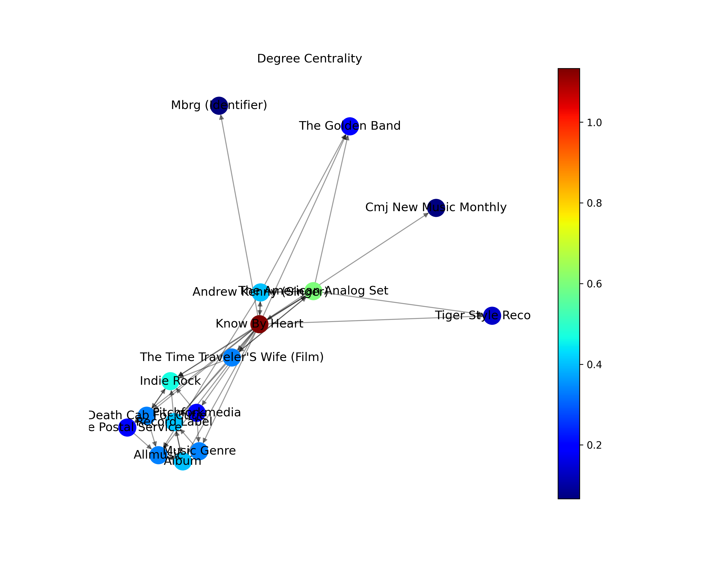
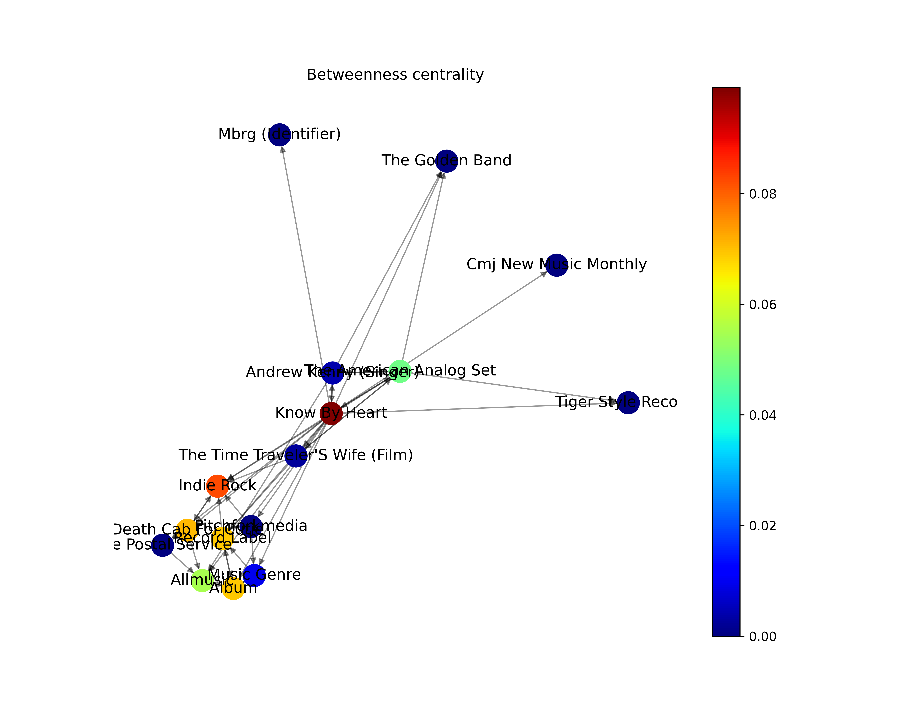
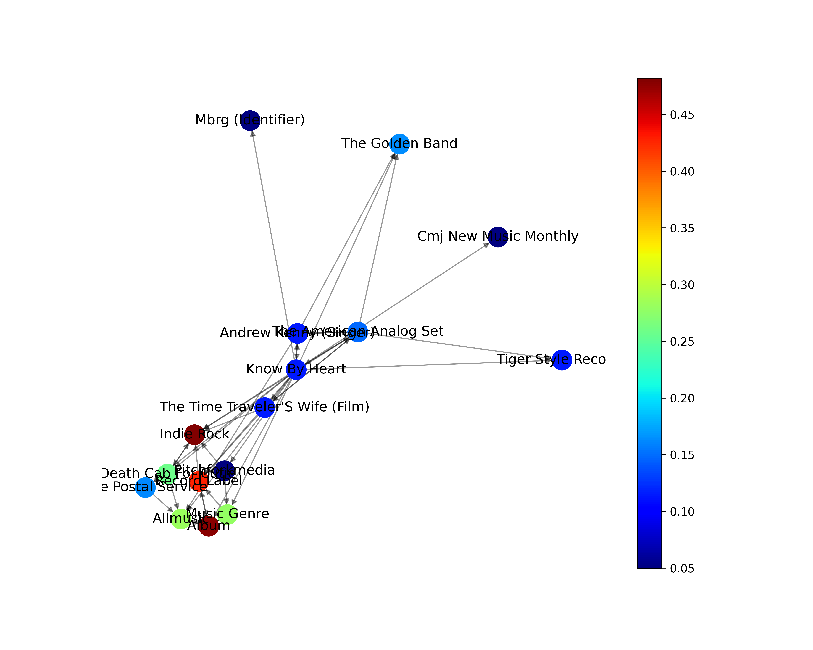

# Trabalho 03 - Unidade 02
## Directed Graph: Building a network with wikipedia

# Integrantes
- Gabriela Cruz Targino 
- Keven Alison dos Santos Bezerra

O vídeo com a explicação do trabalho encontra-se no seguinte link:
[Explicação T3U2](https://drive.google.com/file/d/1nxj1UIcBBA7tGQI-972MHAl2XkLSM0ds/view?usp=sharing)
Obs: Os algoritmos utilizados nesta análise tiveram como base o repositório do desenvolvedor [Alvaro].(https://github.com/alvarofpp/)

Este trabalho tem como objetivo fazer uma análise de uma rede digirida gerada a partir de uma página do WIKIPEDIA, mais especificamente a página do álbum de indie Rock "Know my Heart". Para a execução foi utilizada a linguagem python com o auxílio de bibliotecas de manipulação de grafos além da API da própria wikipédia para a coleta de dados.

## Coletando os dados

Inicialmente foi feita a coleta dos dados e sua devida inserção em formato de grafo. Para isso é definida uma SEED, que neste caso é o nome da página que desejamos ter como ponto de partida, e os STOPS, que são os pontos de parada da busca por links.

(código e imagem do grafo)

Como vamos realizar análises métricas para os dados coletados, é necessário realizar uma filtragem para melhorar os resultados que serão obtidos. Para isso, utilizamos duas etapas de filtragem de dados, na primeira eliminamos dados duplicados, e na segunda, dados que possuem apenas x vizinhos.

## Análise dos dados

### Análise Métrica

Na disciplina de Algoritmo e Estrutura de Dados II, para qual o presente trabalho foi feito, vimos algumas métricas utilizadas na análise de grafos com base nas interações entre os nós.

A primeira métrica é o **Degree Centrality**, esta métrica representa a quantidade de vizinhos que um determinado nó possui. 
<picture>
  <source media="(prefers-color-scheme: dark)" srcset="https://user-images.githubusercontent.com/25423296/163456776-7f95b81a-f1ed-45f7-b7ab-8fa810d529fa.png">
  <source media="(prefers-color-scheme: light)" srcset="https://user-images.githubusercontent.com/25423296/163456779-a8556205-d0a5-45e2-ac17-42d089e3c3f8.png">
  
</picture>

  <source media="(prefers-color-scheme: dark)" srcset="https://user-images.githubusercontent.com/25423296/163456776-7f95b81a-f1ed-45f7-b7ab-8fa810d529fa.png">
  <source media="(prefers-color-scheme: light)" srcset="https://user-images.githubusercontent.com/25423296/163456779-a8556205-d0a5-45e2-ac17-42d089e3c3f8.png">
  

A proxima métrica analisada foi o **Closeness Centrality**, que nos mostra a distancia média de um nó em relação aos demais.

  

Em seguida foi a vez de analisar o **Betweenness Centrality** dos nós da nossa rede, essa métrica diz respeito à frequencia que um nó serve de "passagem" para a conexão de seus nós vizinhos.

  

Por fim, temos o **Eigenvector Centrality**, que é uma métrica que mede a importância de um nó baseado na sua vizinhança.

  

### Distribuição de centralidade
Para esta análise vão ser levadas em consideração duas métricas mencionadas anteriormente, a Degree Centrality e a Closeness Centrality.
