# Trabalho 03 - Unidade 02
## Directed Graph: Building a network with wikipedia

# Integrantes
- Gabriela Cruz Targino 
- Keven Alison dos Santos Bezerra

O vídeo com a explicação do trabalho encontra-se no seguinte link:
[Explicação T3U2](https://drive.google.com/file/d/1nxj1UIcBBA7tGQI-972MHAl2XkLSM0ds/view?usp=sharing)
Obs: Os algoritmos utilizados nesta análise tiveram como base o repositório do desenvolvedor [Alvaro].(https://github.com/alvarofpp/)

Este trabalho tem como objetivo fazer uma análise de uma rede digirida gerada a partir de uma página do WIKIPEDIA, mais especificamente a página do álbum de indie Rock "Know my Heart". Para a execução foi utilizada a linguagem python com o auxílio de bibliotecas de manipulação de grafos além da API da própria wikipédia para a coleta de dados.

## Coletando os dados

Inicialmente foi feita a coleta dos dados e sua devida inserção em formato de grafo. Para isso é definida uma SEED, que neste caso é o nome da página que desejamos ter como ponto de partida, e os STOPS, que são os pontos de parada da busca por links.

(código e imagem do grafo)

Como vamos realizar análises métricas para os dados coletados, é necessário realizar uma filtragem para melhorar os resultados que serão obtidos. Para isso, utilizamos duas etapas de filtragem de dados, na primeira eliminamos dados duplicados, e na segunda, dados que possuem apenas x vizinhos.

## Análise dos dados

### Análise Métrica

Na disciplina de Algoritmo e Estrutura de Dados II, para qual o presente trabalho foi feito, vimos algumas métricas utilizadas na análise de grafos com base nas interações entre os nós.

A primeira métrica é o **Degree Centrality**, esta métrica representa a quantidade de vizinhos que um determinado nó possui. 

  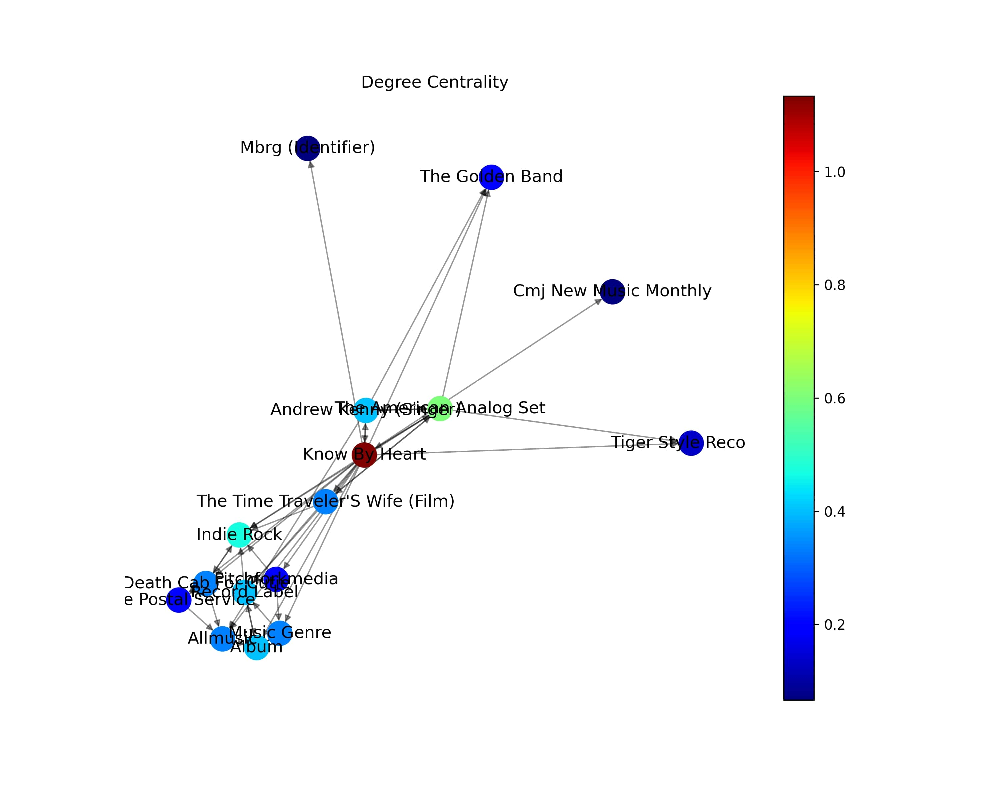

A proxima métrica analisada foi o **Closeness Centrality**, que nos mostra a distancia média de um nó em relação aos demais.

  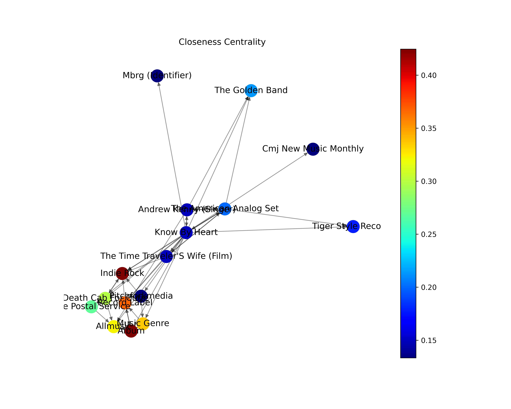

Em seguida foi a vez de analisar o **Betweenness Centrality** dos nós da nossa rede, essa métrica diz respeito à frequencia que um nó serve de "passagem" para a conexão de seus nós vizinhos.

  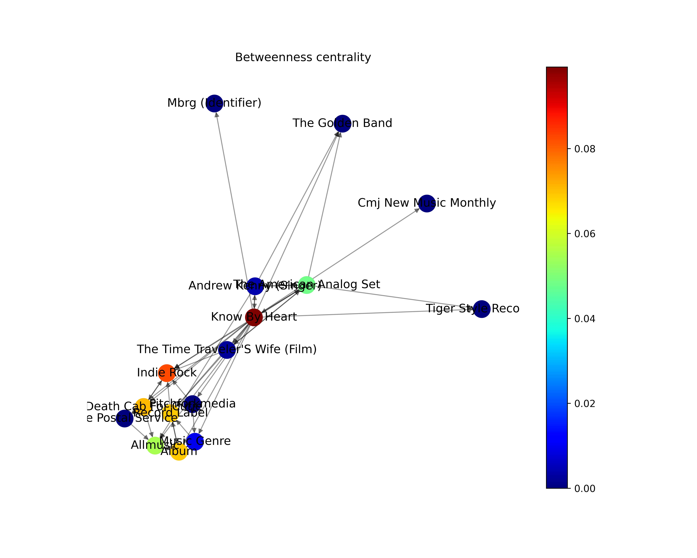

Por fim, temos o **Eigenvector Centrality**, que é uma métrica que mede a importância de um nó baseado na sua vizinhança.

  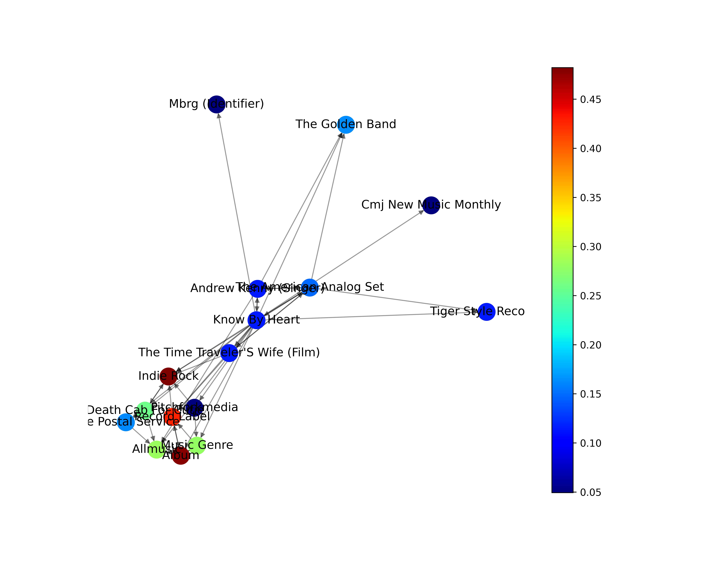

### Distribuição de centralidade
Para esta análise vão ser levadas em consideração duas métricas mencionadas anteriormente, a Degree Centrality e a Closeness Centrality. A partir delas seram geradas duas funções: a PDF (Probability Density Function) e a CDF (Cumulative Density Function).

Inicialmente plotamos o histograma referente ao grau dos nós para analisarmos a rede de uma forma mais ampla. A partir dele é possível observar que grande maioria dos nós está na faixa do grau xx.

(Imagem histograma)

Seguindo a análise, fizemos o plot do PDF, que se trata da Função Densidade de Probabilidade. Essa função basicamente estima o valor de uma variável aleatória X com base em um dado valor Y. Para nosso contexto basicamente ela vai estimar quantos nós possuem certo valor de grau de centralidade.

  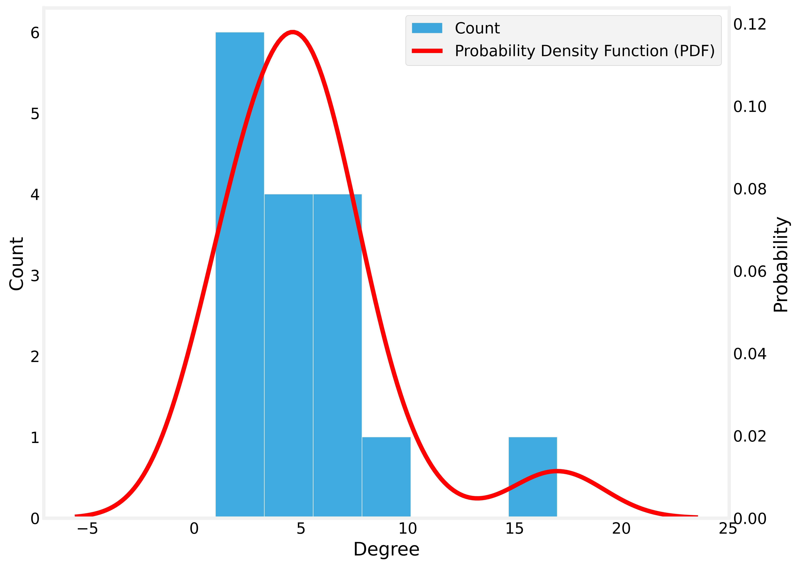

Em seguida foi plotado o gráfico referente ao CDFM, que se trata da Função de Distribuição Acumulada. Essa função basicamente estima a probabilidade de uma variável aleatória X ser menor ou igual a dado valor Y. Para nosso contexto basicamente ela vai estimar a probabilidade de uma certa quantidade de nós possuirem valor menor ou igual a um determinado grau de centralidade.

  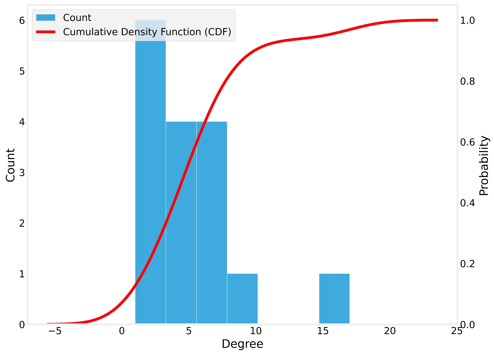

### Análise de Distribuições
Para uma análise mais comparativa plotamos os gráficos correspondentes às métricas para observar como se comportam em comparação às demais.

  

### Decomposição do Core

  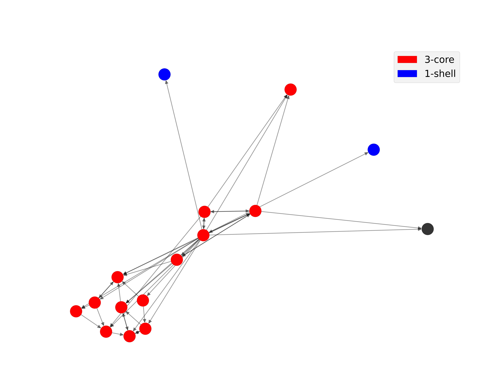

### Análise dos dados através do Software GEPHI
Enquanto realizavamos nosso trabalhao percebemos certas dificuldades em analisar a nossa rede quando ela estava muito extensa, fazendo com que reduzíssemos bastante o numero de nós e links para que fosse possível uma visualização mais legível. Visando uma análise mais detalhada sobre a rede, utilizamos o software Gephi para visualizarmos a nossa rede e suas características.

Agora que possuímos uma ferramente mais avançada, reduzimos algumas limitações na geração da nossa rede, permitindo que um grafo com mais nós e conexões fosse gerado. O grafo utilizado como base no Gephi foi o gerado na etapa de coleta e tratamento dos dados, visto anteriormente, com filtro = 3, [disponível aqui](https://github.com/KevenAlison/ED2---PROJECTS/blob/main/Projeto%205%20-%20WIKIPEDIA%20DATA%20ANALYSIS/WikipediaNetwork.graphml). Ele possui 99 nós e 368 arestas. A partir do grafo, utilizaremos plugins para gerar uma rede que seja capaz de transmitir suas informações visualmente através de sua divisão de acordo com a **centralidade de autovetor** (Eigenvector centrality).

A centralidade de autovetor foi vista anteriormente como uma métrica que mede a importância de um nó baseado na sua vizinhança, isto é, ela mede a influência de um nó em uma rede. Assim, nós utilizaremos essa métrica para visualizar os nós com mais influência na rede da página do álbum de indie Rock "Know my Heart".

Na imagem abaixo, podemos visualizar os índices mais e menos comuns de centralidade de autovetor presentes na rede.

  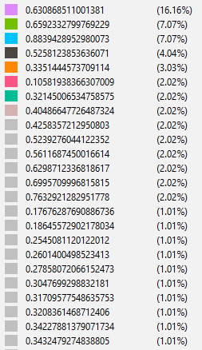

  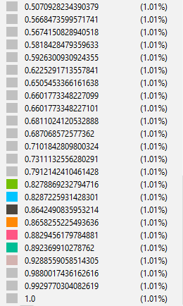

É possível perceber que 16.16% dos nós da rede possui uma centralidade de autovetor de 0.63, enquanto apenas 1.01% dos nós possui o índice como 1. Uma vez que a rede possui 99 nós, é possível estabelecer uma relação de 1 para 1, isto é: 16 nós possuem a centralidade de autovetor de 0.63, enquanto 1 nó possui esse valor como sendo 1.

O software também nos permite visualizar as porcentagens junto com os nomes dos nós, conforme pode ser visualizado na imagem abaixo.

  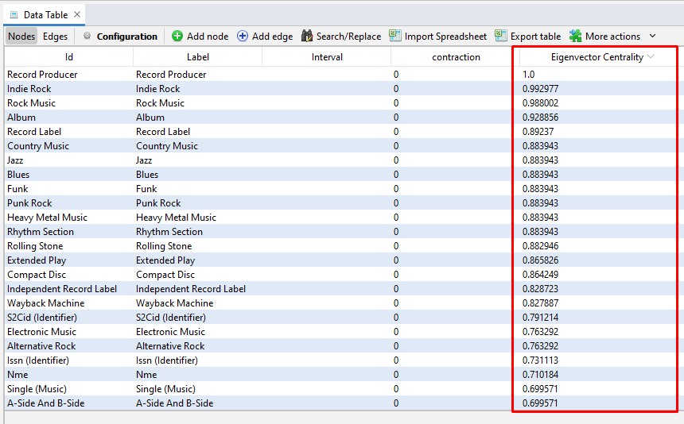

Desse modo, podemos observar que os nós com maior influência na rede são, respectivamente:
- Record Producer;
- Indie Rock;
- Rock Music.

Esse resultado está de acordo com o esperado, uma vez que a página se trata de um álbum de música indie rock. O resultado também está de acordo com o que foi obtido utilizando os códigos em Python vistos acima.

A visualização da rede com base na métrica de centralidade de autovetor está disponível abaixo.

  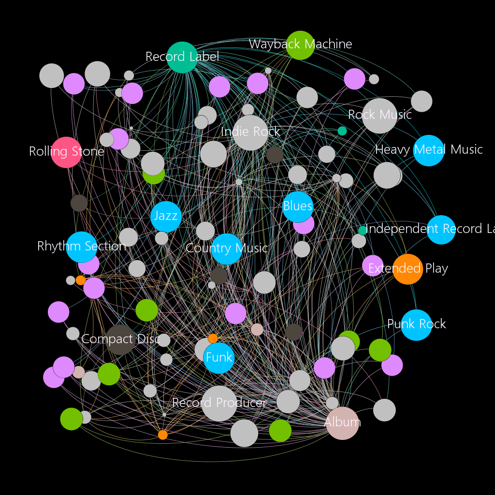

Na visualização criada, o tamanho dos nós cresce de acordo com a centralidade de autovetor. Além disso, os nós que possuem essa métrica acima de 0.8 estão nomeados na figura.

O link para interação com a rede coloridada de acordo com a métrica criada está disponível [aqui](https://kevenalison.github.io/ED2---PROJECTS/network/#).

### Uma outra visualização: utilização do GEPHISTO

O Gephisto corresponde a outra maneira de visualizar uma rede. Disponibilizada no [Github de um dos criadores do Gephi](https://jacomyma.github.io/gephisto/), o software gera uma visualização diferente para o grafo, em que o tamanho dos nós dependem do grau de cada um e todos possuem a mesma cor. O grafo para a rede da página do álbum "Know my Heart" pode ser observado abaixo:

  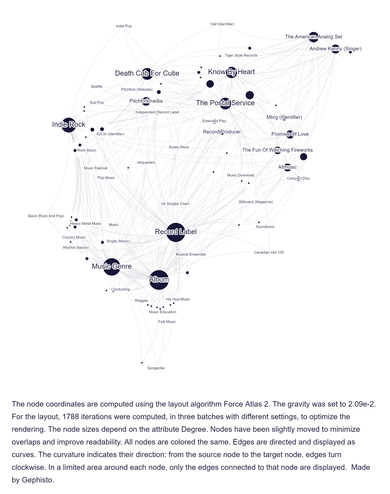

